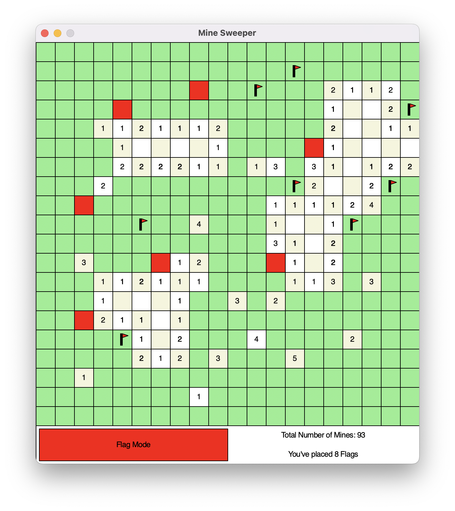
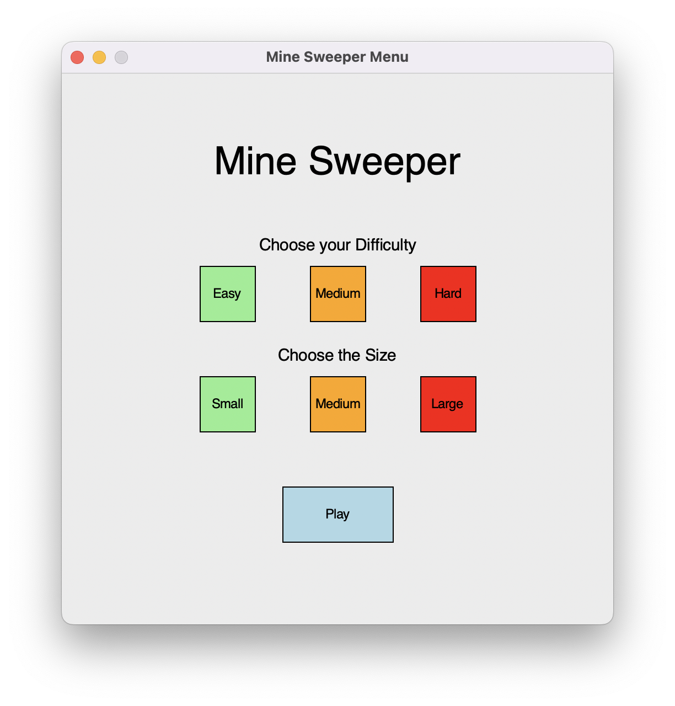
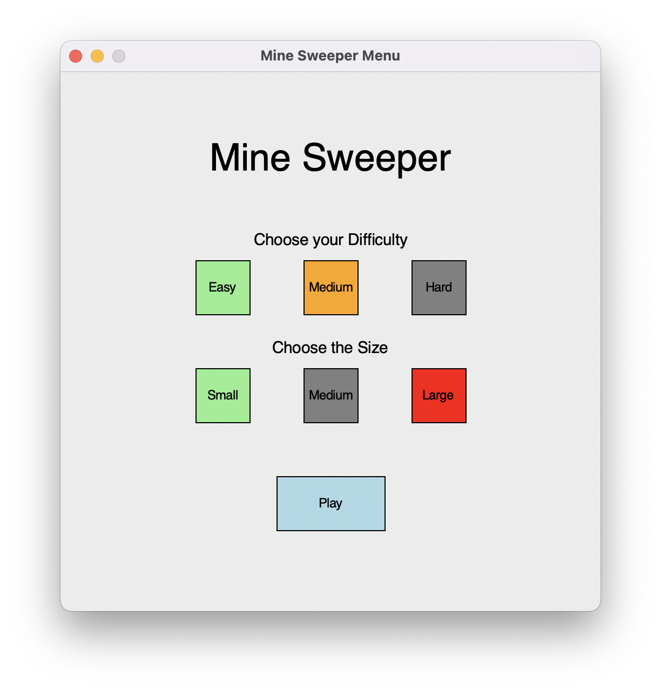
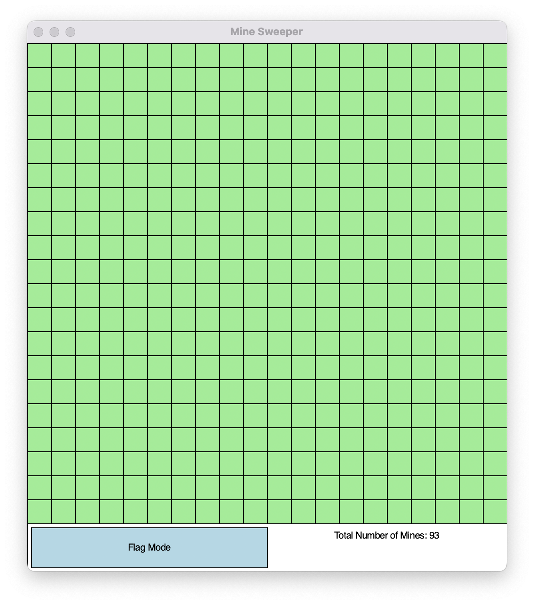
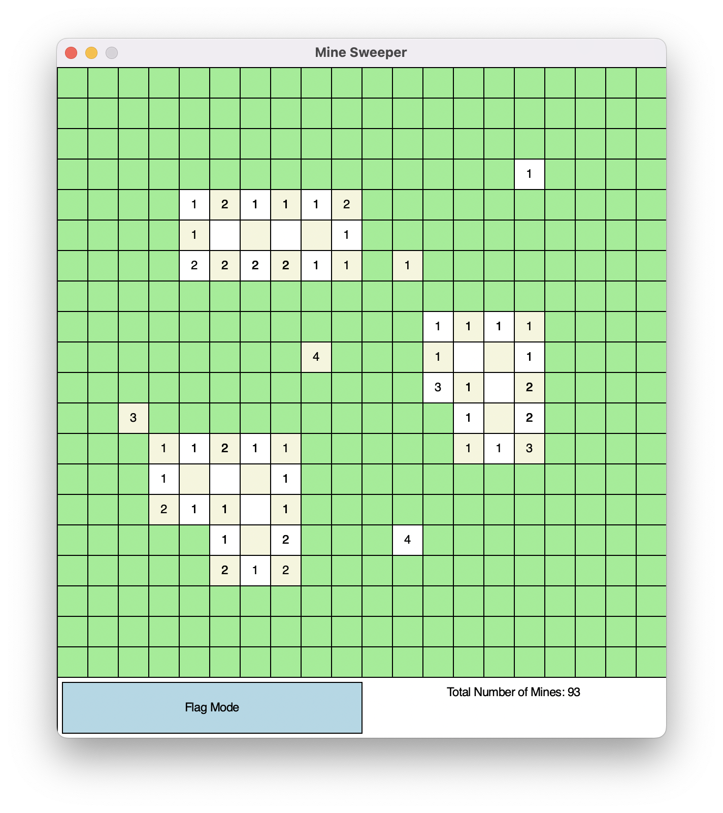
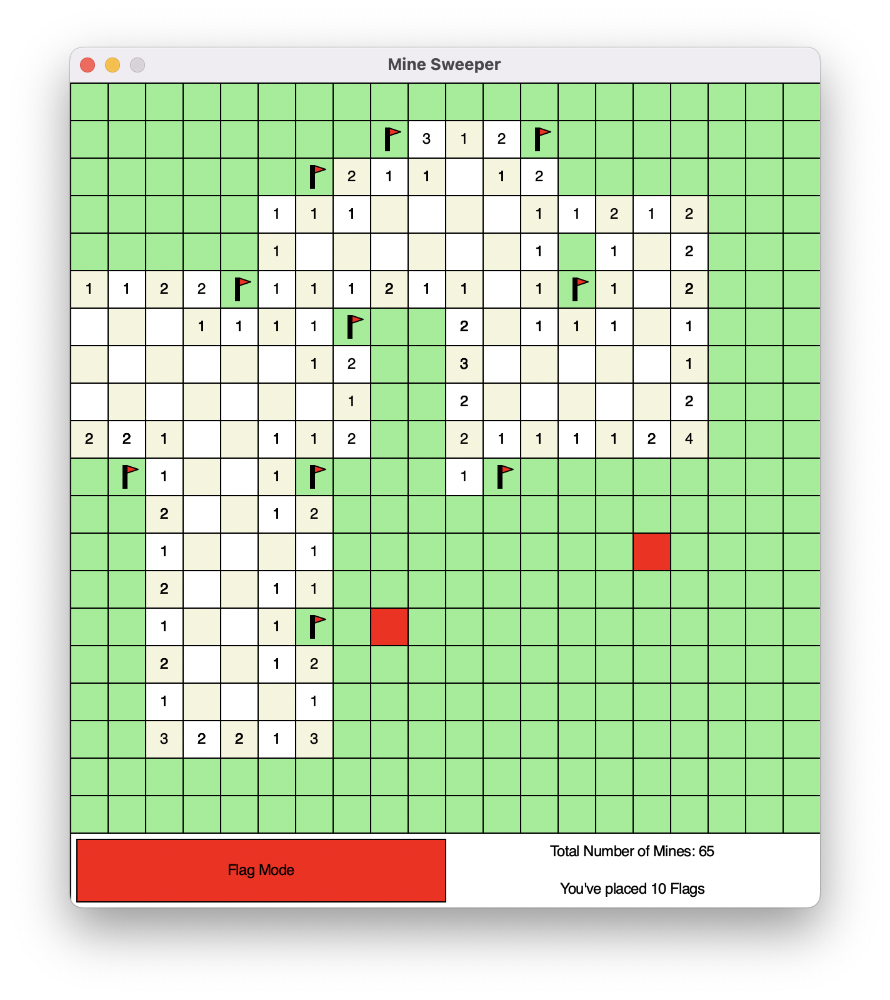
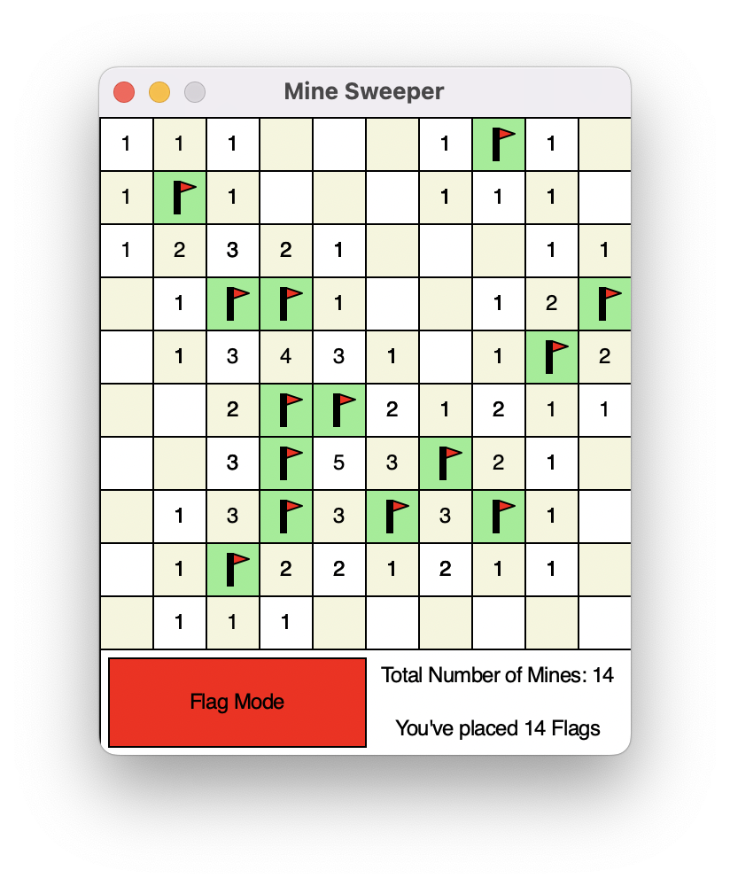
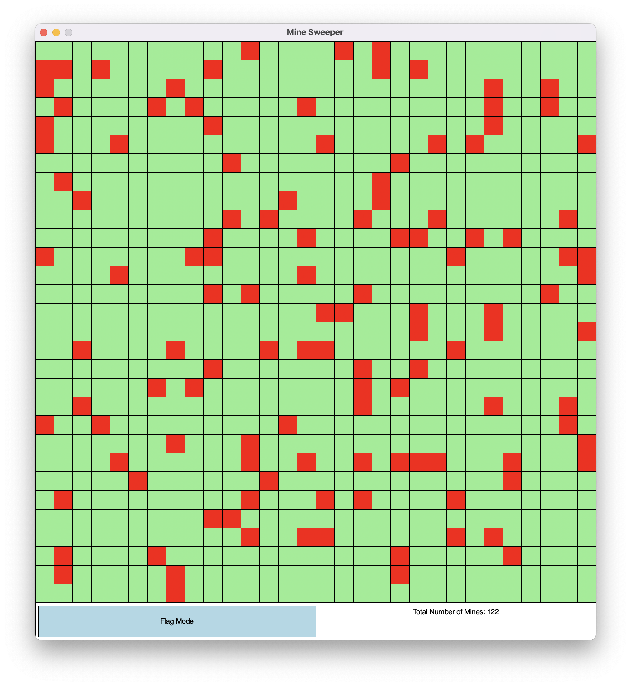
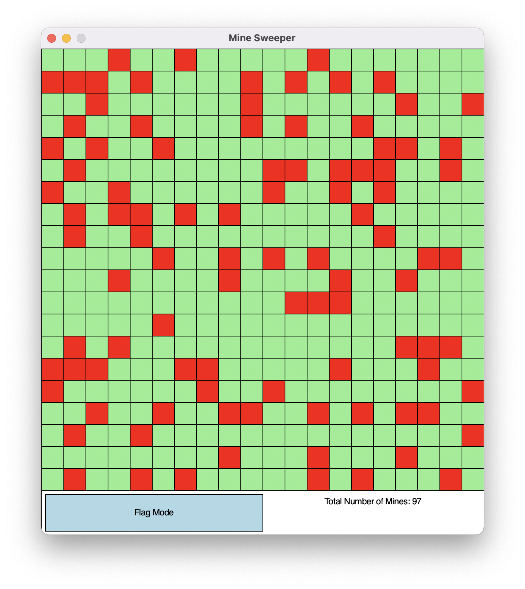
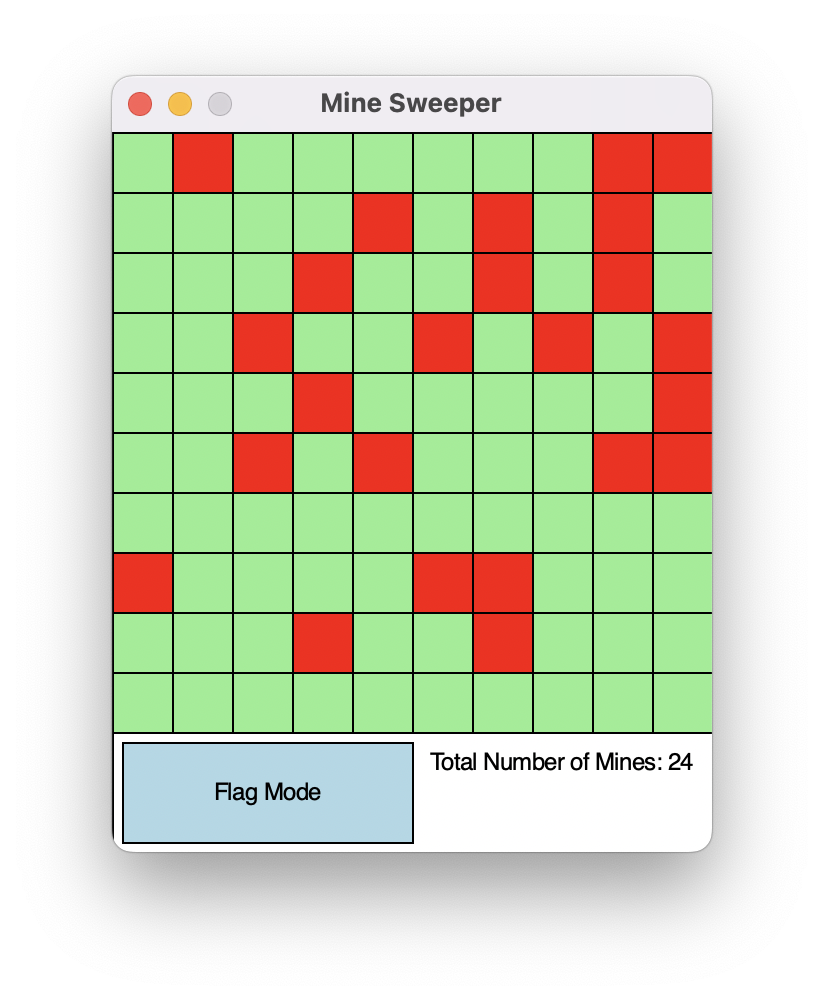

# Python Minesweeper 💣

A __Minesweeper__ protoype written in __Python__ using John Zelle's __graphics.py__ (simple object oriented graphics library). This was a small side-project that lasted 2 weeks to apply and practise the skills I learned in the first half of my first teaching block in my first-year Programming module, at the University of Portsmouth.

## Table of contents
- [Overview](#overview)
- [Main Features](#main-features)
  - [Start Page](#start-page)
  - [Size & Difficulty](#Different-Game-Sizes-and-Difficulty)
  - [Flagging Mines](#flag-mode)
- [Requirements](#requirements)
- [Usage](#usage)
- [Last Note](#note)

## Overview

The primary objective of this side-project was to develop a working prototype of __Minesweeper__. The prototype needed to have an intuitive user interface and basic features such as flagging bombs, and clearing spaces with no bombs.

## Main Features

### Start Page

A fully interactive and intuitive start page where you can select the difficulty and the map size.

#### Start Page

#### Chosen Settings

### Working Game

Functioning minesweeper, where you can clear and flag spaces, see the total number of mines, and the number of flags placed.

#### Blank Game

#### Small Cleared Section

### Flag Mode

#### Placing Flags

#### Cleared Game

### Different Game Sizes and Difficulty

Functioning game size settings with a set size of easy: 10 x 10, medium: 20 x 20 and hard: 30 x 30. The different difficulty settings were determined by the chance of a space having a mine, easy: 15%, medium: 20% and hard: 25%.

#### Difficulty: Easy, Size: Large

#### Difficulty: Hard, Size: Medium

#### Difficulty: Medium, Size: Small

## Requirements

* Python 3
* graphics.py

This project utilises John Zelle's __graphics.py__ library. Please ensure this is in the same directory as the __mineSweeper.py__ for the Minesweeper to function properly.

## Usage

1. Clone this project
3. Run [__mineSweeper.py__](./mineSweeper.py)
4. Choose your difficulty and size

### Note

This is project is still unfinished with some features still missing such as, a win window, a way of keeping track of previous attempts, etc.

## Thank you for reading 👋
